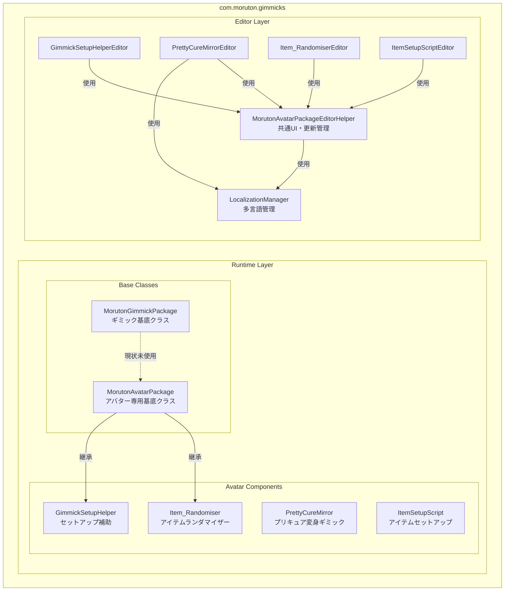
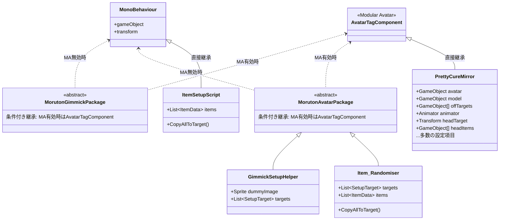
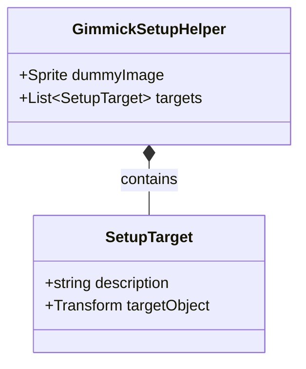
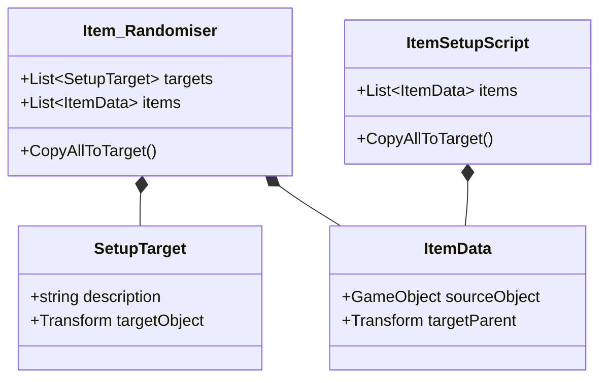
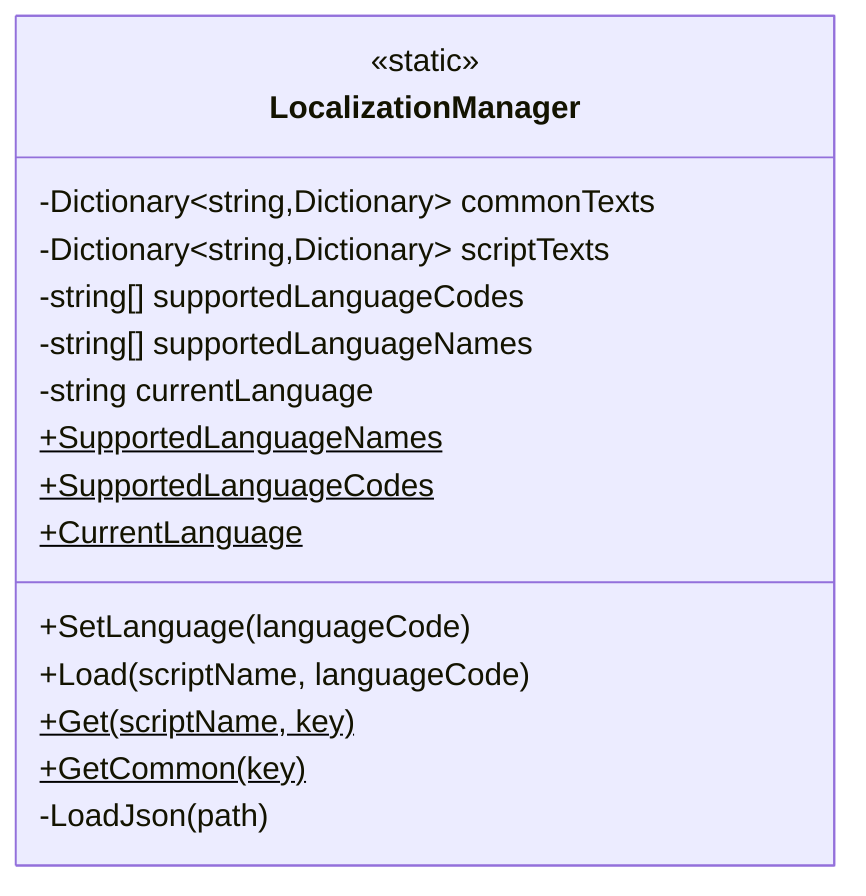
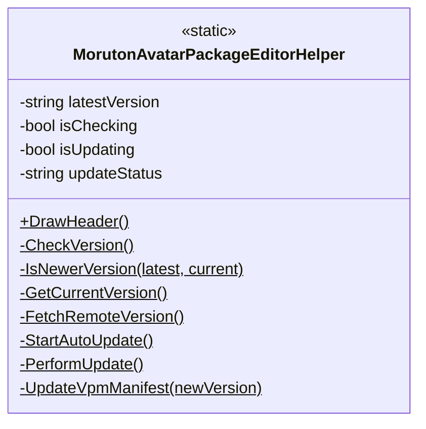
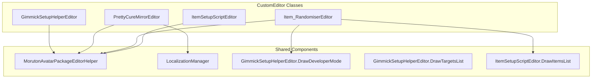

# com.moruton.gimmicks アーキテクチャ

## 全体構成



## Runtime Layer

### Base Classes



### GimmickSetupHelper データ構造



### Item_Randomiser / ItemSetupScript データ構造



## Editor Layer

### LocalizationManager



対応言語: 日本語 (ja), English (en), 한국어 (ko), Italiano (it), Español (es)

### MorutonAvatarPackageEditorHelper



機能:
- ヘッダー描画 (ロゴ、Booth/Discordリンク)
- バージョンチェック (GitHubリリース確認)
- 自動更新 (ZIP ダウンロード → 展開 → 適用)

### Editor Classes 構成



## ファイル構成

```
com.moruton.gimmicks/
├── Runtime/
│   ├── MorutonGimmickPackage.cs
│   └── Avatars/
│       ├── MorutonAvatarPackage.cs
│       ├── GimmickSetupHelper.cs
│       ├── PrettyCureMirror.cs
│       ├── Item_Randomiser.cs
│       └── ItemSetupScript.cs
├── Editor/
│   └── Avatars/
│       ├── LocalizationManager.cs
│       ├── MorutonAvatarPackageEditorHelper.cs
│       ├── GimmickSetupHelperEditor.cs
│       ├── PrettyCureMirrorEditor.cs
│       ├── Item_RandomiserEditor.cs
│       ├── ItemSetupScriptEditor.cs
│       └── Localization/
│           ├── Common/
│           │   ├── ja.json
│           │   ├── en.json
│           │   ├── ko.json
│           │   ├── it.json
│           │   └── es.json
│           └── PrettyCureMirror/
│               ├── ja.json
│               ├── en.json
│               ├── ko.json
│               ├── it.json
│               └── es.json
└── Documentation/
    └── Architecture.md
```

## 役割まとめ

| コンポーネント | 役割 |
|--------------|------|
| **MorutonGimmickPackage** | ギミックの基底クラス（Modular Avatar自動切替）※現状未使用 |
| **MorutonAvatarPackage** | アバター専用ギミックの基底クラス（Modular Avatar自動切替） |
| **GimmickSetupHelper** | アバターセットアップ補助コンポーネント（説明文・対象管理） |
| **PrettyCureMirror** | プリキュア変身ギミック（衣装切替・アニメーション生成） |
| **Item_Randomiser** | アイテムランダマイザー（ターゲット調整・アイテム入れ替え） |
| **ItemSetupScript** | アイテムセットアップ（ソース→ターゲットコピー） |
| **LocalizationManager** | JSON多言語対応管理（5言語対応） |
| **MorutonAvatarPackageEditorHelper** | 共通ヘッダーUI・バージョンチェック・自動更新 |
| **GimmickSetupHelperEditor** | GimmickSetupHelper用Inspector UI |
| **PrettyCureMirrorEditor** | PrettyCureMirror用Inspector UI（多言語対応） |
| **Item_RandomiserEditor** | Item_Randomiser用Inspector UI（タブ切替） |
| **ItemSetupScriptEditor** | ItemSetupScript用Inspector UI |
