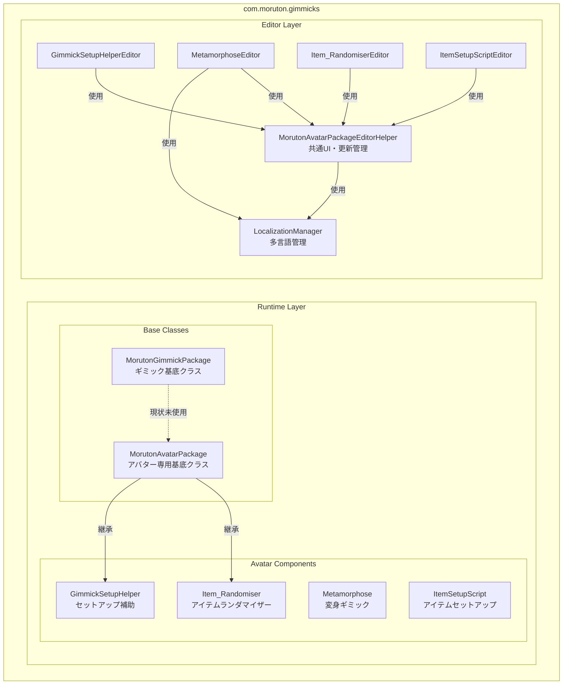
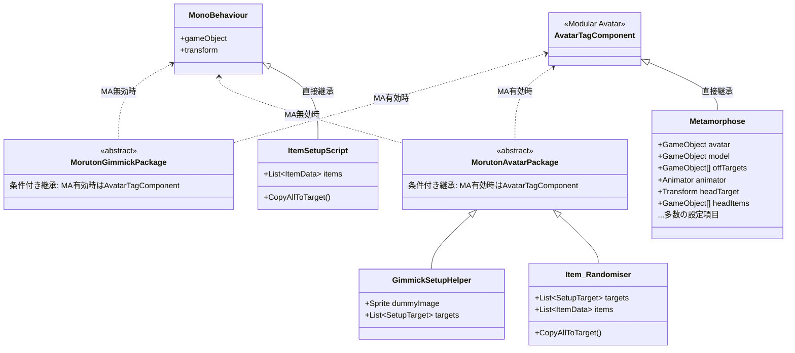
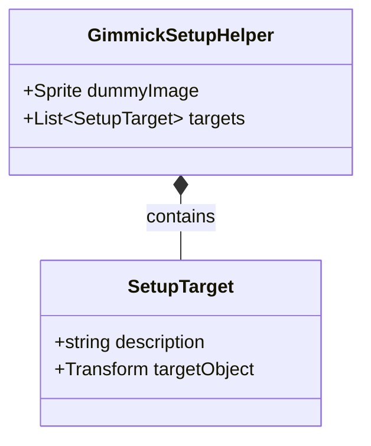
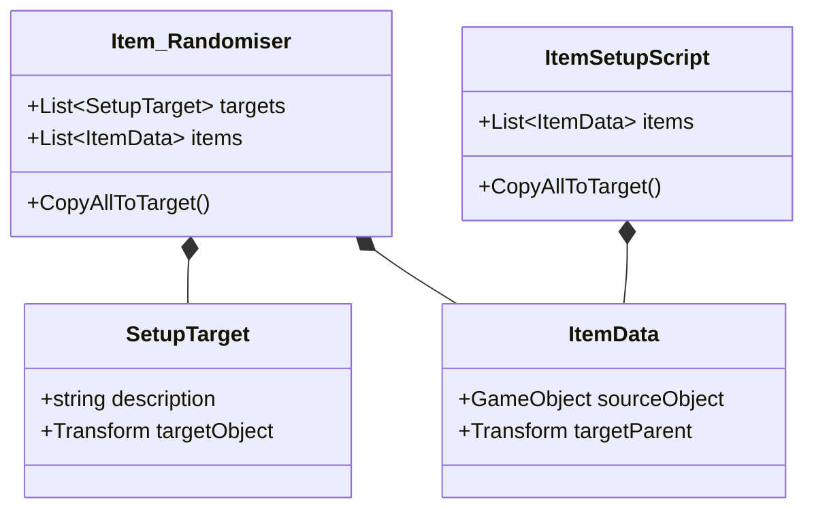
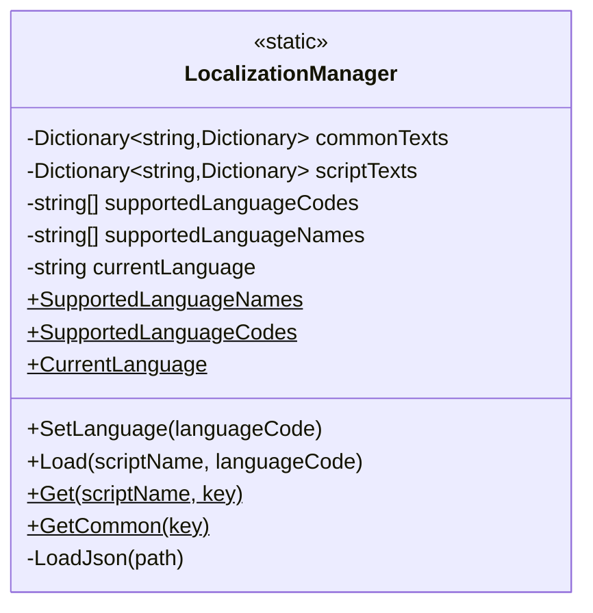
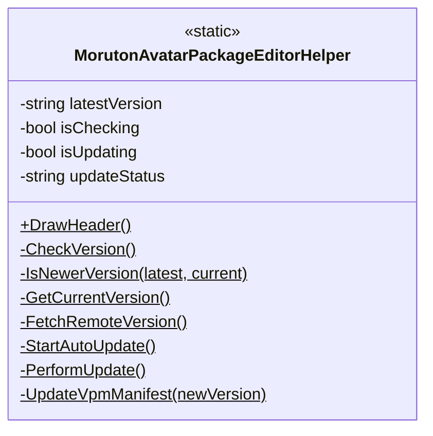

# com.moruton.gimmicks アーキテクチャ

## 全体構成



## Runtime Layer

### Base Classes



### GimmickSetupHelper データ構造



### Item_Randomiser / ItemSetupScript データ構造



## Editor Layer

### LocalizationManager



対応言語: 日本語 (ja), English (en), 한국어 (ko), Italiano (it), Español (es)

### MorutonAvatarPackageEditorHelper



機能:
- ヘッダー描画 (ロゴ、Booth/Discordリンク)
- バージョンチェック (GitHubリリース確認)
- 自動更新 (ZIP ダウンロード → 展開 → 適用)

### Editor Classes 構成


## ファイル構成

```
com.moruton.gimmicks/
├── Runtime/
│   ├── MorutonGimmickPackage.cs
│   └── Avatars/
│       ├── MorutonAvatarPackage.cs
│       ├── GimmickSetupHelper.cs
│       ├── Metamorphose.cs
│       ├── Item_Randomiser.cs
│       └── ItemSetupScript.cs
├── Editor/
│   └── Avatars/
│       ├── LocalizationManager.cs
│       ├── MorutonAvatarPackageEditorHelper.cs
│       ├── GimmickSetupHelperEditor.cs
│       ├── MetamorphoseEditor.cs
│       ├── Item_RandomiserEditor.cs
│       ├── ItemSetupScriptEditor.cs
│       └── Localization/
│           ├── Common/
│           │   ├── ja.json
│           │   ├── en.json
│           │   ├── ko.json
│           │   ├── it.json
│           │   └── es.json
│           └── Metamorphose/
│               ├── ja.json
│               ├── en.json
│               ├── ko.json
│               ├── it.json
│               └── es.json
└── Documentation/
    └── Architecture.md
```

## 役割まとめ

| コンポーネント | 役割 |
|--------------|------|
| **MorutonGimmickPackage** | ギミックの基底クラス（Modular Avatar自動切替）※現状未使用 |
| **MorutonAvatarPackage** | アバター専用ギミックの基底クラス（Modular Avatar自動切替） |
| **GimmickSetupHelper** | アバターセットアップ補助コンポーネント（説明文・対象管理） |
| **Metamorphose** | 変身ギミック（衣装切替・アニメーション生成） |
| **Item_Randomiser** | アイテムランダマイザー（ターゲット調整・アイテム入れ替え） |
| **ItemSetupScript** | アイテムセットアップ（ソース→ターゲットコピー） |
| **LocalizationManager** | JSON多言語対応管理（5言語対応） |
| **MorutonAvatarPackageEditorHelper** | 共通ヘッダーUI・バージョンチェック・自動更新 |
| **GimmickSetupHelperEditor** | GimmickSetupHelper用Inspector UI |
| **MetamorphoseEditor** | Metamorphose用Inspector UI（多言語対応） |
| **Item_RandomiserEditor** | Item_Randomiser用Inspector UI（タブ切替） |
| **ItemSetupScriptEditor** | ItemSetupScript用Inspector UI |

## Shader 命名・格納ガイドライン

`Runtime/Shaders/` フォルダは、パッケージに含まれるカスタムシェーダーの格納場所です。
パッケージの整理と命名規則を綺麗に維持するため、以下のルールに従ってシェーダーを格納・定義します。

### 1. Shaderの定義名（Shader Path）の規則
シェーダーファイル内で宣言する `Shader "Moruton/Package/～～～"` のパス名は、以下のカテゴリ分類に従って記述します。
※頭文字は大文字の `Moruton/Package/...` に統一し、複数形を使用します。

| カテゴリ | パス名規則 | 用途・説明 |
|---|---|---|
| **パーティクル・演出系** | `Shader "Moruton/Package/Particles/[ShaderName]"` | パーティクルシステムやギミックの発光・変身演出用 |
| **アバター用** | `Shader "Moruton/Package/Avatars/[ShaderName]"` | フェード用マテリアルやアバターに直接適用する質感用 |
| **ワールド用** | `Shader "Moruton/Package/Worlds/[ShaderName]"` | ワールドギミックや背景・環境演出用のシェーダー |
| **共通・ユーティリティ** | `Shader "Moruton/Package/Common/[ShaderName]"` | デバッグ表示や、複数のギミックで広く共用する基本処理 |

### 2. 現行シェーダー（ComonParticleShader）の書き換え提案
現在格納されている `ComonParticleShader.shader` をこの規則に則って綺麗に整理するための推奨される書き換え手順は以下の通りです。

#### 2-1. スペルミスと冗長な名称の修正（ファイル名）
- **現状のファイル名**: `Runtime/Shaders/ComonParticleShader.shader` ('m'が1つでスペルミス、末尾の `Shader` が冗長)
- **変更後のファイル名**: `Runtime/Shaders/CommonParticle.shader` (Commonのスペルを修正し、拡張子と重複する `Shader` を除去)

#### 2-2. Shader定義名の書き換え (Shader Path)
- **現状の定義名**: `Shader "moruton/Package/Particle/ComonParticleShader"`
- **決定した対応**: **定義名は変更せず維持** (既存のマテリアルの参照破損を防ぐため、シェーダーファイル内部の定義名は変更せず、ファイル名のみのリネームとします)

