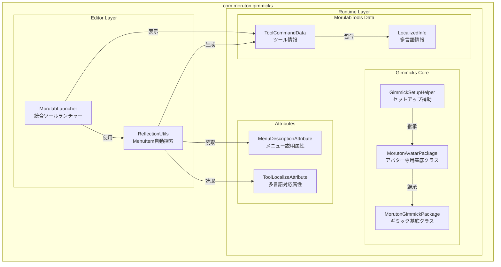
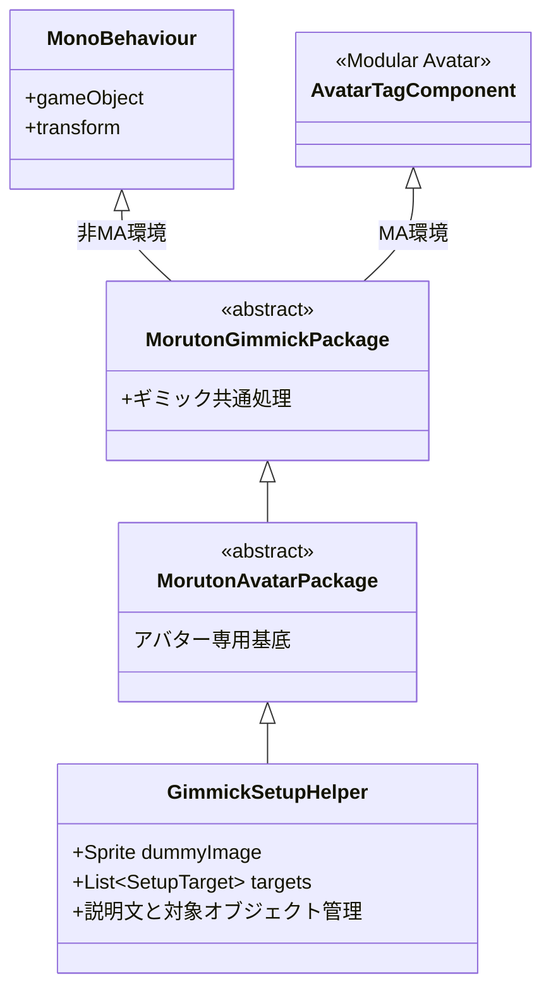
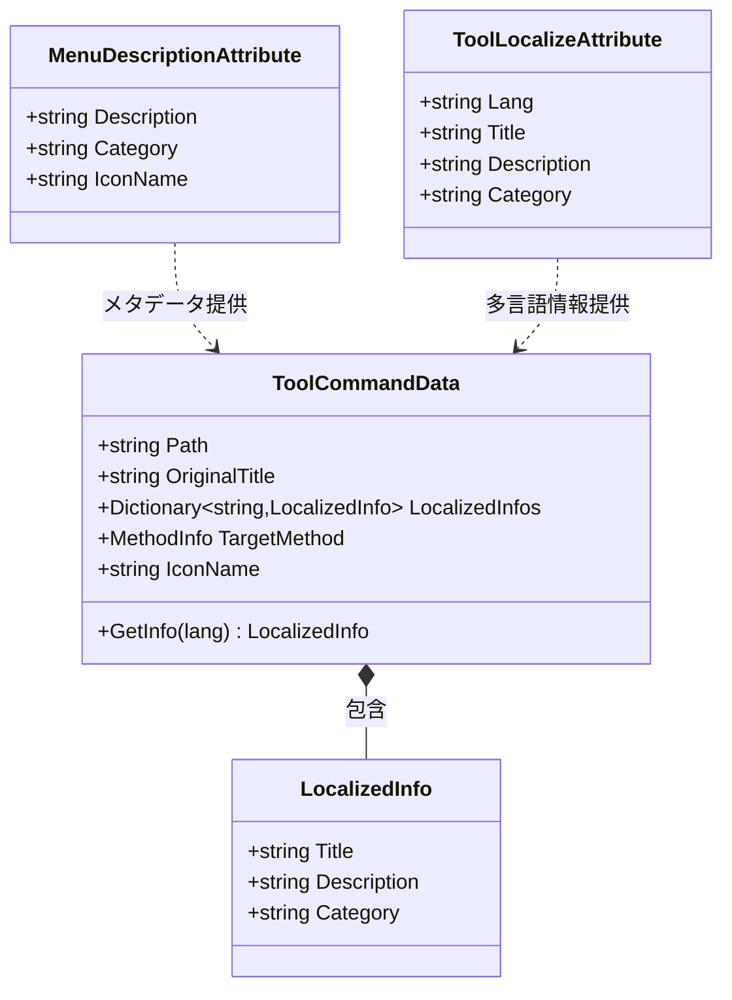
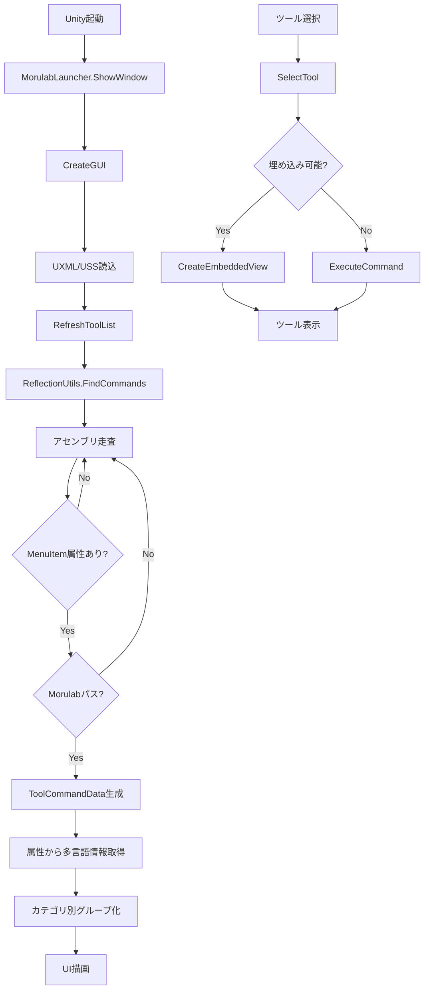
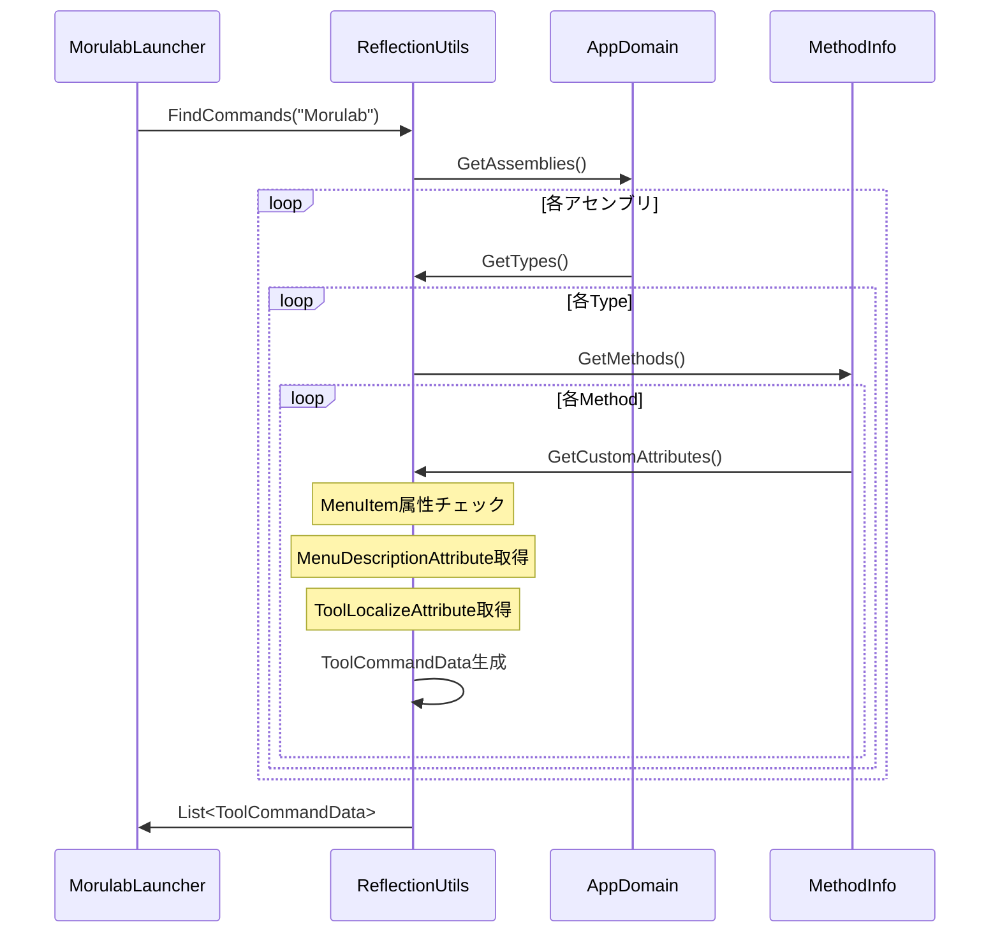

# com.moruton.gimmicks アーキテクチャ

## 全体構成

## Runtime Layer

### Gimmicks Core

### MorulabTools Data & Attributes

## Editor Layer

### MorulabLauncher フロー

### ReflectionUtils 処理フロー

## 役割まとめ

| コンポーネント | 役割 |
|--------------|------|
| **MorutonGimmickPackage** | ギミックの基底クラス（Modular Avatar自動切替） |
| **MorutonAvatarPackage** | アバター専用ギミックの基底クラス |
| **GimmickSetupHelper** | アバターセットアップ補助コンポーネント |
| **MorulabLauncher** | 統合ツールランチャーUI（多言語対応） |
| **ReflectionUtils** | MenuItem自動検出・ツール登録 |
| **ToolCommandData** | ツール情報データクラス |
| **LocalizedInfo** | 多言語対応情報 |
| **MenuDescriptionAttribute** | メニュー説明付与属性 |
| **ToolLocalizeAttribute** | 多言語対応属性 |
